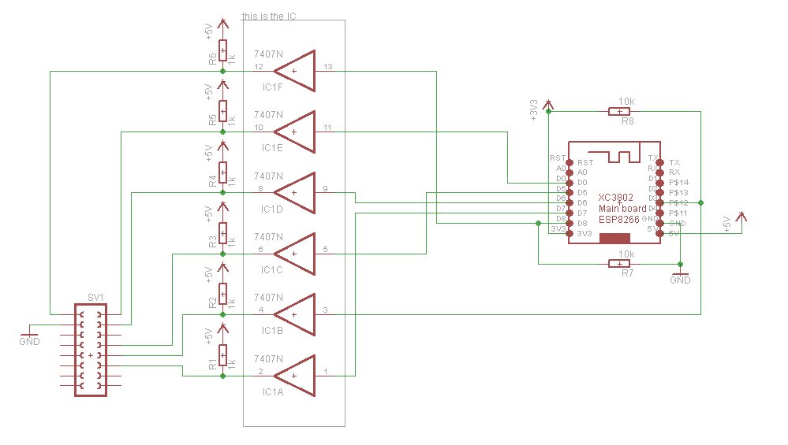
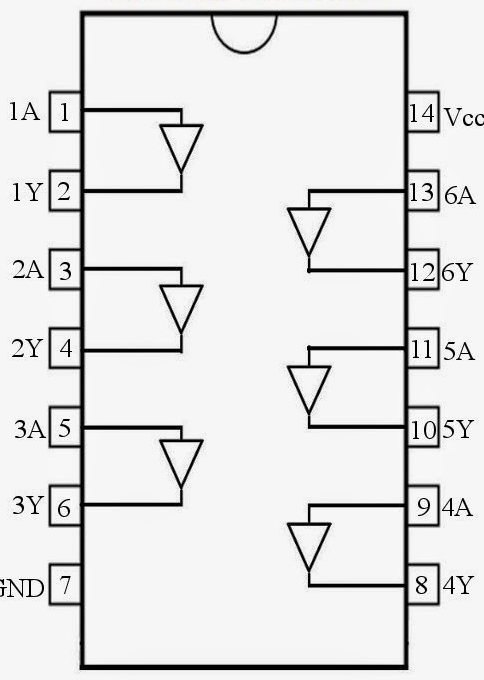
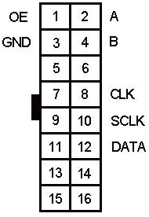
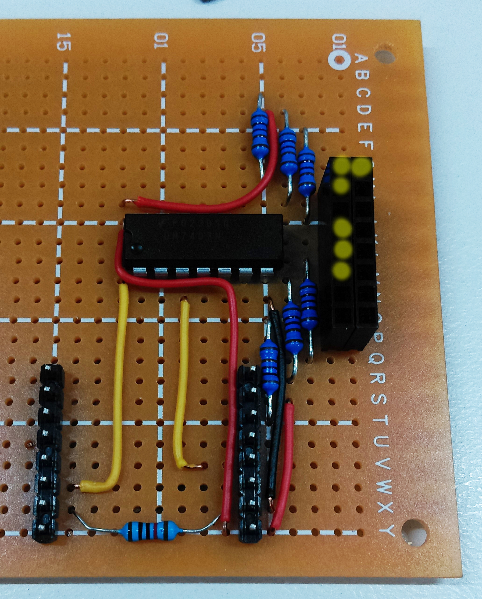
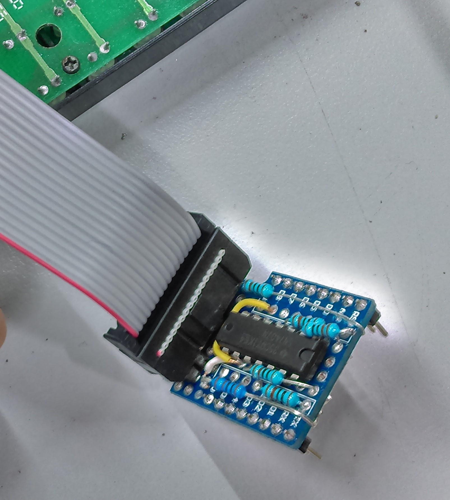
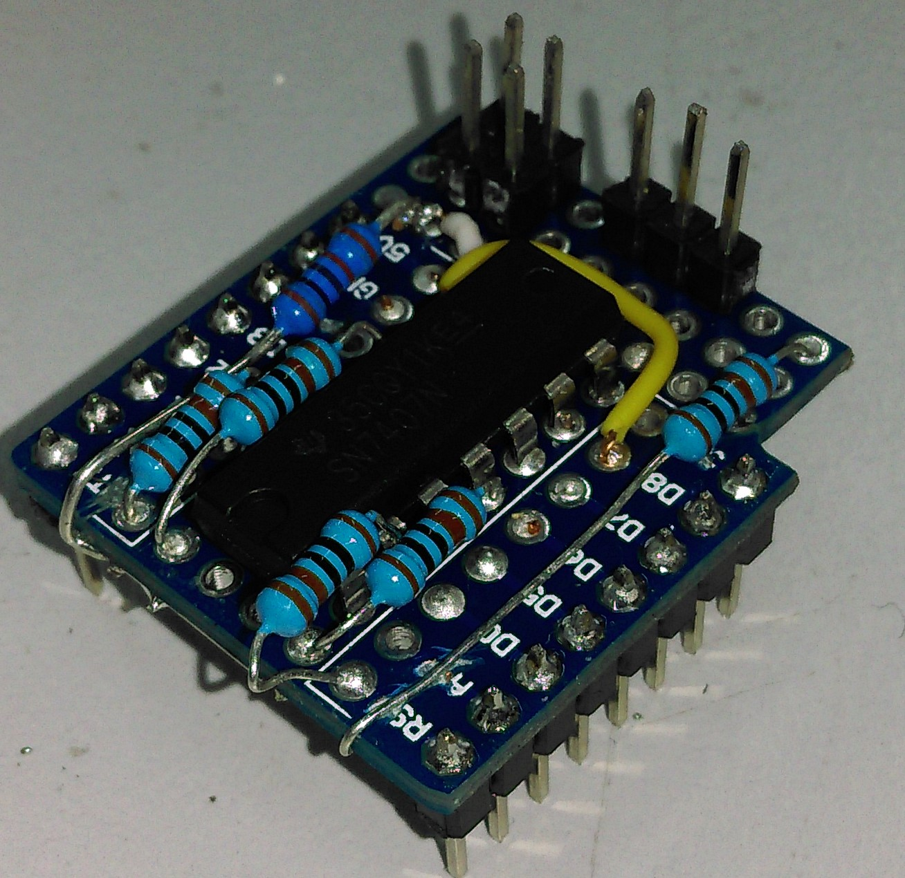
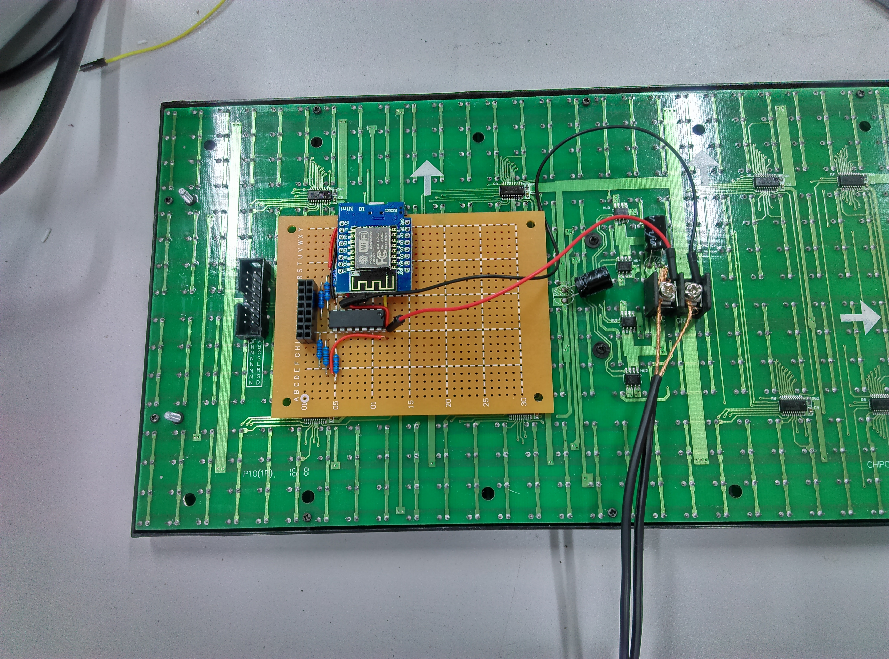
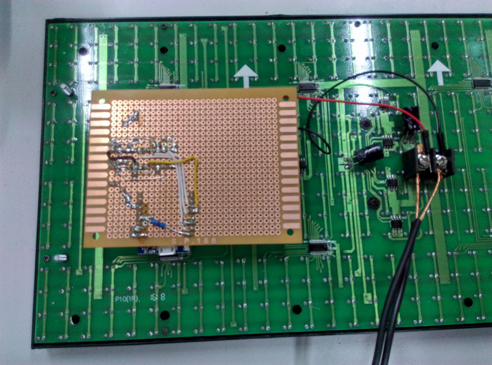

# WiFi Sign

This neat project can instantly decorate your shop window, bedroom door, or loungeroom. It allows you to mount a dot matrix display somewhere in your house and connect to it through the same network. Then using a custom HTTP server, you can access the sign through its network address and change it to display a clock, text, or anything else that you might want.


## Bill of Materials
| Qty | Code | Description |
| --- | --- | ---|
|1 | [XC4622](http://jaycar.com.au/p/XC4622) | White dot matrix display panel
|1 | [XC3802](http://jaycar.com.au/p/XC3802) | ESP8266
|1 | [ZS5807](http://jaycar.com.au/p/ZS5807) | 7407 hex buffer IC
|1 | [HP9550](http://jaycar.com.au/p/HP9550) | universal pre-punched experimenters board
|1 | [RR0596](http://jaycar.com.au/p/RR0596) | 10k resistor pack
|1 | [RR0572](http://jaycar.com.au/p/RR0572) | 1k resistor pack

## Connections


This is the general circuit diagram for the set up. We connect the ESP8266 to the DMD through a 7407 hex buffer, which acts as a makeshift “level converter” to change from the 3.3v ESP to 5v for the panel. The ESP comes with multiple headers, so we will use both the male ( to mount the ESP) and the female (to connect to DMD) headers.

It's simple as that really.



This is the hex buffer chip that we're using. Data pins must go through one of the A pins, then the corresponding Y pin then goes to the DMD. This is a cheap way to make a makeshift logic level converter. These are open-collector outputs, so we must use pull up resistors so that they work correctly.



The DMD pinout is much like what you’ve seen before, with the 3 serial lines in the middle and the A/B/OE pins to the top. The pins (3,5,7,9,11,13,15) in this diagram are all connected to ground so any one of these would do for a ground connection.


The final point to note is that the ESP requires two pull-ups to correctly boot into itself. If the pins are floating, it might want to go into “programming mode” and not run its own commands. These are simple 10k resistors connecting D8-GND and D3-3v3. These are shown in the schematic diagram as R7 and R8.

Read further and look at some pictures to get an understanding of how the board is laid out and fits to the panel.

## Downloads
* [Source code](https://github.com/duinotech/IoT-Wireless-Sign/archive/master.zip)

## Software libraries

|Library | Author | Version | 
|---| ---| --- |
|DMD2 | Freetronics | 0.0. 3 |
|NTPClient | Fabrice Weinberg | 3.1.0 |


* Use the SPIFFS tool from the ESP8266 community, located at [on this github page.](https://github.com/esp8266/arduino-esp8266fs-plugin)

* Be sure to change your arduino environment to program the ESP8266 as shown in the [manual.](https://www.jaycar.com.au/p/XC3802)

## Assembly

As for the layout of the board, Mine is shown. It’s not quite the prettiest board but it works for the time being.

lay out the board however you want, following the connection diagram above.



The final note is using the 5v wall socket supply to power the device. you can bridge wires between the DMD's VCC/GND screw terminals to 5V and GND on your protoboard to make the whole Assembly run off the wall socket.

As mentioned, this is a revisited version, the original version was designed to fit on the protoshield like such:



however with such a tight space it was hard to make things nice and connected. many many resistor leads pushed down the same PCB hole than the IC, simply because there wasn't any spare PCB holes to use.



This is the second attempt at the first version, and by this point it was only half-done and had no more room to spare.

While it looks clean and tidy, it's like a jaguar car. A real mess underneath and a pain to fix problems with.

So we went ahead with version two, post publication. Same circuit, same everything, but laid out on a bigger board with more room.

it also uses an on-board connection for the DMD panel, to make things nice and tidy.


_disconnected from panel_


_connected to panel_

note the USB for the ESP pointing out the bottom.

Follow the circuit diagram if you get stuck. Each pin from the DMD connector must be tied to 5V using resistors, and they connect to the output pins on the hex chip.

each input of the hex chip is coming straight from the ESP.
then the ESP has 2 resistors to boot properly.


## Programming

* Remember! [ESP8266 on Arduino ](https://www.jaycar.com.au/p/XC3802)


Download the source code and extract into a new folder, open the .ino file in the Arduino IDE.

You should see three variables there is to set:

```c++
#define WIFI_SSID ""
#define WIFI_PWD ""
#define LOCATION "mainroom"
```

Set these to your wifi name, password, and the location of the sign, then upload to the ESP.

#### SPIFFS
We are using SPIFFS tool located [here](https://github.com/esp8266/arduino-esp8266fs-plugin) - Follow their install instructions, and upload the SPIFFS data to the ESP device.

Once that is done, you should find the ESP serves the index.html from within the data directory.


## Use

Once the ESP is connected to the WiFi network, it makes a website hosted on "http://mainroom.local" which "mainroom" is the room name you set before. If that does not work, you can use the Serial Monitor to see what the IP is when it boots.

When you are at the website, you can find a radio button for "text" or "clock" and a text field. set the text to what you want and hit submit. You should see the sign showing up with the text you've set.

There is also the speed setting for how fast the marquee scrolls past.


## Future Improvements
* The DMD also has a brightness setting, use this in the control panel.
* Get a small picture frame to frame the sign.
* You can interface with another arduino and use a small speaker [AS3006](http://jaycar.com.au/p/AS3006) to play some melodies from your sign as well.
